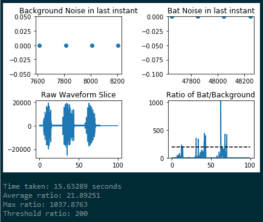
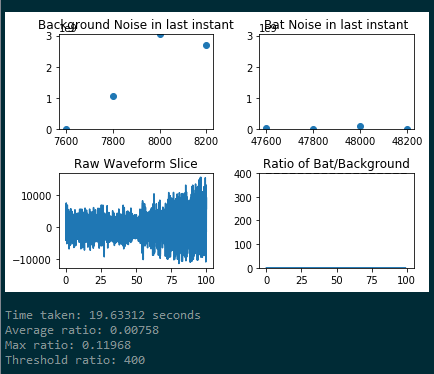

# bat-detection
A prototype using discrete fourier transforms and a shifting buffer window to detect bat echolocations amongst background noise I designed for an internship.

Since this is a very specific project, it relies on some very specific files. You'll have to scroll down to line ~230 and change the filenames there if you want to use your own files.

The program also outputs some helpful graphs:

 

If the ratio value (seen in the "Ratio of Bat/Background" graph) surpasses the black dotted line, then the system records a positive bat detection event. You can see above that on the left sample a bat IS detected, and on the right a bat is NOT detected.
